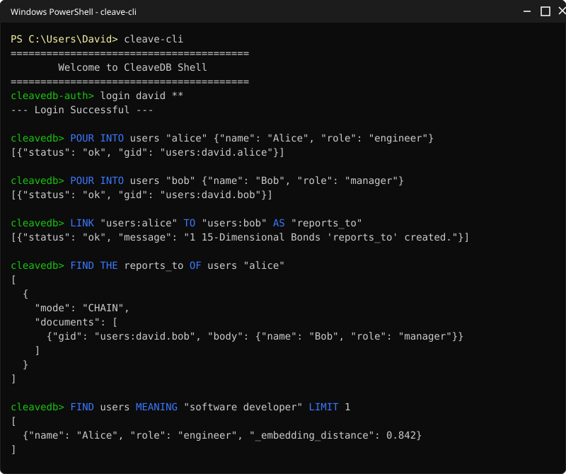

<div align="center">
  
  <br/><br/>
  <p><strong>The polyglot, AVX-512 accelerated, non-relational database with Transformer attention layers.</strong></p>
  
  []()
  []()
  []()
  []()
</div>

<br/>

**CleaveDB 3.5** is a ground-up, hybrid NoSQL document database that eliminates the complexity of traditional SQL `JOIN`s, external vector search services, and opaque graph databases. It ships with:

- A high-performance **Rust storage engine** built entirely from scratch — no SQLite, no RocksDB, no external storage libraries.
- **AVX-512 / AVX2 C++ SIMD extensions** wired directly into the Rust engine for hardware-accelerated math operations.
- A **Python interpreter frontend** (via PyO3 bindings) that runs the **CleaveQL** query language.
- **Real neural Transformer embeddings** for semantic search via a quantized ONNX model, using ~22MB of RAM.
- A **Go-based distributed coordinator** with scatter-gather and K-way merge for multi-shard deployments.
- A **TCP server** (`cleavedb_server.py`) with full authentication, background Cron worker, and **multi-tenant Document-Level Security (DLS)**.

### See it in action:
<div align="center">
  
</div>

---

## 🏗️ Architecture & Toolchain

```
┌─────────────────────────────────────────────────────────┐
│                  CleaveQL (Python Layer)                │
│   Lexer ──► Parser ──► AST ──► Interpreter             │
│         attention/sra.py  ─── ONNX Q8 Transformer      │
│         cleaveql/security.py ── GBAC / DLS / Masking   │
│         cleaveql/cost_model.py ── Query Cost Estimation │
└────────────────────────┬────────────────────────────────┘
                         │  PyO3 FFI
┌────────────────────────▼────────────────────────────────┐
│              Rust Storage Engine                        │
│   BPlusTree ── WAL (Group Commit) ── Buffer Pool        │
│   Bloom Filter ── LZ4 Page Compression ── AES-256-GCM  │
│   SIMD FFI: AVX-512 dot_product, softmax, gelu, matmul │
│   Coordinator FFI ─── Go ScatterGather / K-Way Merge   │
└─────────────────────────────────────────────────────────┘
```

### Toolchain Components

| Layer | Technology | Component | Description |
|---|---|---|---|
| **Storage** | Rust 2021 | `storage/src/` | Hand-built B+Tree, 16KB pages with CRC32, CLOCK-sweep buffer pool, WAL with group commit, Bloom filters, AES-256-GCM at-rest encryption |
| **SIMD** | C++ (AVX-512/AVX2) | `simd/src/` | Hardware-accelerated dot product (4× unrolled FMA), softmax, GELU, sigmoid, layer norm, matrix multiply. Auto-fallback to scalar on unsupported CPUs |
| **Coordinator** | Go 1.21 | `coordinator/src/` | Scatter-gather across shards with goroutine concurrency, K-way merge via min-heap in O(N log K), C-shared FFI export |
| **Interpreter** | Python 3.13 | `cleaveql/` | Recursive-descent parser producing 34 AST node types, security policy engine (GBAC + RBAC + DLS + Masking) |
| **AI Search** | ONNX Runtime | `attention/sra.py` | Semantic Relevance Attention — quantized `all-MiniLM-L6-v2` Transformer generating 384-dim embeddings, cosine similarity ranking |
| **Bindings** | PyO3 / Maturin | `storage/src/python.rs` | Zero-copy Rust↔Python bridge exposing `pour`, `get`, `scan_bucket`, `delete`, `heal`, `show` |

---

## 🚀 Getting Started

### Requirements
- Python 3.13+, Rust 2021 (`cargo`), C++ build tools
- `onnxruntime`, `tokenizers`, `huggingface_hub`, `numpy`

### Installation
```bash
# 1. Install Python dependencies (AI Semantic Search & PyO3 compilation)
pip install -r requirements.txt

# 2. Compile native extensions (Rust storage, Go coordinator, C++ SIMD)
python build.py

# 3. Start the TCP Server
python cleavedb_server.py

# 4. In a new terminal, open the CLI
python cleave_cli.py
```

---

## 🔒 Authentication & Multi-Tenancy

CleaveDB enforces authentication before any query. Every client must `register` or `login` through the CLI shell.

### Registration
```
cleavedb-auth> register
Username: david
Password: ********
Dev Password (superuser override): ********
Security Question: What was the name of your first pet?
Answer: rover
```
Passwords are hashed with **PBKDF2-HMAC-SHA256** (100,000 iterations, 16-byte random salt). Security questions and answers are encrypted at rest with **AES-256-GCM** via a Fernet key (`cleavedb.key`).

### Login (Dual Privilege Levels)
```
cleavedb-auth> login
Username: david
Password: ********           → Standard user prompt: david@cleavedb>
Password: <dev_password>     → Dev superuser prompt: root@cleavedb>
```
- **Standard users** can read/write their own data.
- **Dev superusers** can additionally access hidden system buckets (`_auth`, `_cron`, `_bonds`, `_security_policies`).

### Password Recovery
```
cleavedb-auth> forgot
Username: david
→ Server returns decrypted security question
Answer: rover
New Password: ********
```

### Multi-Tenant Isolation
Every document, bond, and security policy is **automatically namespaced** with the creator's tenant ID:

```
david@cleavedb> POUR INTO products "laptop" {"price": 999}
→ Stored as: products:david.laptop

john@cleavedb> FIND products
→ Returns: [] (zero results — John cannot see David's data)
```

Document-Level Security (DLS) filtering is enforced at the engine level on every scan. Even a Dev Superuser logged in as John **cannot** see David's documents.

---

## 📖 Complete CleaveQL Reference

CleaveDB defines **25+ commands** with **170 token types** producing **34 AST node types**. Every query reads like natural English.

---

### 1. POUR - Insert / Upsert Documents

<div align="center"></div>

```sql
POUR INTO <bucket> "<id>" {json}
POUR INTO <bucket> RANDOM {json}
POUR INTO <bucket> "<id>" {json} WITH SECRET "<password>"
POUR MANY INTO <bucket> [{json}, {json}, ...]
POUR {json} INSIDE <bucket> "<id>" AT <field.path>
```

| Modifier | Description |
|---|---|
| `RANDOM` | Auto-generates a cryptographic 64-bit hex ID |
| `WITH SECRET "<pw>"` | Hashes password via PBKDF2 and creates an `_auth` entry — registers a sub-user account |
| `MANY` | Bulk-inserts an array of documents in one statement |
| `INSIDE ... AT <path>` | Injects JSON into a nested field path of an existing document |

**Examples:**
```sql
POUR INTO users "alice" {"name": "Alice", "age": 28, "role": "admin"}
POUR INTO events RANDOM {"type": "click", "page": "/home"}
POUR INTO users "bob" {"name": "Bob", "role": "viewer"} WITH SECRET "bobpass123"
POUR MANY INTO products [{"gid": "p1", "name": "Laptop"}, {"gid": "p2", "name": "Phone"}]
POUR {"tool": "CleaveDB"} INSIDE users "alice" AT profile.skills
```

---

### 2. FIND / SCOOP - Query & Retrieve Documents

<div align="center"></div>

`FIND` is the primary read verb (alias: `SCOOP`). It supports **10 query modes** and **12 chainable modifiers**.

#### Query Modes

| Mode | Syntax | Description |
|---|---|---|
| `EVERYTHING` | `FIND <bucket>` | Default — returns all matching documents |
| `FIRST` | `FIND THE FIRST <n> FROM <bucket>` | First N documents |
| `LAST` | `FIND THE LAST <n> FROM <bucket>` | Last N documents |
| `TALLY` | `FIND THE TALLY OF <bucket>` | Document count |
| `TOTAL` | `FIND THE TOTAL <field> FROM <bucket> GROUPED BY <field>` | Grouped summation |
| `HIGHEST` | `FIND THE HIGHEST <n> <field> FROM <bucket>` | Top N by field (descending) |
| `LOWEST` | `FIND THE LOWEST <n> <field> FROM <bucket>` | Bottom N by field (ascending) |
| `UNIQUE` | `FIND ONLY UNIQUE <field> FROM <bucket>` | Distinct values for a field |
| `RELATED` | `FIND "<label>" OF "<source_id>"` | Direct graph bond traversal |
| `CHAIN` | `FIND THE <rel1> OF THE <rel2> OF <bucket> "<id>"` | Multi-hop deep graph traversal |

#### Chainable Modifiers (combine in any order)

| Modifier | Syntax | Description |
|---|---|---|
| `WHERE` | `WHERE <field> <op> <value> [AND/OR ...]` | Boolean predicate filtering (`=`, `!=`, `>`, `<`, `>=`, `<=`) |
| `WHOSE` | `WHOSE <field> IS <value>` | Exact field match (easy English) |
| `MENTIONING` | `MENTIONING "<text>"` | Full-text keyword substring search |
| `MEANING` | `MEANING "<text>"` | AI vector semantic search (ONNX Transformer) |
| `MATCHING` | `MATCHING "<json>"` | JSON structural template matching |
| `INCLUDE` / `WITH` | `WITH <field1>, <field2>` | Eager join of related documents |
| `YIELD` / `SHOW` | `SHOW <field1>, <field2>` | Field projection (return only these fields) |
| `ARRANGED BY` | `ARRANGED BY <field> GOING UP/DOWN` | Sort results (aliases: `SORTED BY`, `ORDER BY`, `ASC`/`DESC`) |
| `LIMIT` | `LIMIT <n>` | Restrict number of results |
| `GROUPED BY` | `GROUPED BY <field>` | Grouping for aggregations |
| `AS OF` | `AS OF "<timestamp>"` / `AS OF yesterday` | Time-travel historical query |
| `CANDIDATE` | `FIND CANDIDATE "<label>" OF "<id>"` | Include dormant conditional bonds |

**Examples:**
```sql
FIND products
FIND products WHERE price > 50 AND category = "Electronics"
FIND products WHOSE category IS "Books" ARRANGED BY price GOING DOWN LIMIT 5
FIND products MENTIONING "wireless headphones"
FIND products MEANING "something warm for cold weather" LIMIT 3
FIND THE TALLY OF users
FIND THE HIGHEST 5 salary FROM employees
FIND ONLY UNIQUE department FROM employees
FIND THE TOTAL revenue FROM sales GROUPED BY region
FIND THE FIRST 10 FROM logs
FIND EVERYTHING FROM users SHOW name, email
```

---

### 3. `CHANGE` / `UPDATE` — Partial Update Documents

```sql
CHANGE "<doc_id>" IN <bucket> TO <field> = <value>
CHANGE <bucket> "<doc_id>" SET <field> TO <value>
CHANGE <bucket> "<doc_id>" SET <field1> TO <val1>, <field2> TO <val2>
```

**Sub-Scoop injection** — dynamically set a field from another query's result:
```sql
CHANGE teams "devs" SET new_hires TO (SCOOP EVERYTHING FROM users WHOSE role IS "developer")
```

If updating the `secret` field, CleaveDB automatically re-hashes the password in `_auth`.

---

### 4. `DRAIN` — Soft-Delete Documents

Moves documents to the `_rubbish` bin (auto-purged after 3 days by the Cron Worker).

```sql
DRAIN <bucket> "<doc_id>"
DRAIN <bucket> WHERE <predicates>
DRAIN <bucket> BEFORE "<datetime>"
```

Cascading: if the drained document has bonds marked `ON DELETE CASCADE`, all bonded targets are also drained.

---

### 5. `SALVAGE` — Restore from Rubbish

```sql
SALVAGE "<doc_id>" FROM _rubbish
SALVAGE EVERYTHING FROM _rubbish
```

---

### 6. `INCINERATE` — Permanently Destroy

```sql
INCINERATE "<doc_id>" FROM _rubbish
INCINERATE EVERYTHING FROM _rubbish
```

---

### 7. LINK / BOND - 15-Dimensional Graph Relationships

<div align="center"></div>

CleaveDB bonds are not just static pointers — they are richly configurable relationship objects with up to **15 behavioral dimensions**.

```sql
LINK "<source>" TO "<target>" AS "<label>"
LINK "<source>" TO "<target>" AS MUTUAL "<label>"
LINK "<source>" TO ANY("<t1>", "<t2>") AS "<label>"
```

#### All Bond Modifiers

| Modifier | Syntax | Description |
|---|---|---|
| `MUTUAL` | `AS MUTUAL "<label>"` | Creates bidirectional bonds (both directions) |
| `EXCLUSIVELY` | `EXCLUSIVELY` | Expires all prior active bonds with the same source + label |
| `CASCADE` | `ON DELETE CASCADE` | Automatically deletes target when source is drained |
| `CONFIDENCE` | `WITH CONFIDENCE <float>` | Probabilistic edge weight (0.0–1.0) |
| `AFFINITY` | `WITH AFFINITY <float>` | Relationship strength weight (0.0–1.0) |
| `EXPIRING IN` | `EXPIRING IN <n> HOURS/MINUTES` | Ephemeral time-bound bond with TTL |
| `CONDITION` | `IF <subject> <field> IS <value>` | Conditional/dormant bond — only active when condition is true |
| `THROUGH` | `THROUGH "<node>"` | Routes edge through an intermediate node |
| `ANY` | `TO ANY("<id1>", "<id2>")` | Multi-target — creates bonds to multiple targets |

Condition subjects: `source`, `target`, `their`, `its`, `his`, `her`, `my`

**Examples:**
```sql
LINK "users:alice" TO "users:bob" AS MUTUAL "friend"
LINK "users:alice" TO "session:s1" AS "active_session" EXPIRING IN 1 HOUR
LINK "order:5521" TO "users:alice" ON DELETE CASCADE
LINK "doc:1" TO "topic:ai" AS "tagged" WITH CONFIDENCE 0.94
LINK "users:bob" TO "product:shoes" AS "interested" WITH AFFINITY 0.87
LINK "users:alice" TO "project:x" AS "member" EXCLUSIVELY
LINK "users:alice" TO "file:secret.pdf" AS "can_read" IF target clearance IS "public"
```

---

### 8. `SEVER` / `UNLINK` — Destroy Graph Bonds

```sql
SEVER "<source>" FROM "<target>" AS "<label>"
SEVER "<source>" FROM "<target>"
```

---

### 9. `DROP SECURITY` — Remove Security Policies & Masks

```sql
DROP SECURITY "<name>" ON <bucket>
```

Removes both the named policy and any field mask matching that name on the bucket — from memory and from persistent storage.

---

### 10. Graph Traversal — Single-Hop & Multi-Hop

**Direct lookup (1 hop):**
```sql
FIND "friend" OF "users:alice"
```

**Deep chain traversal (N hops):**
```sql
FIND THE friend OF THE friend OF users "alice"
FIND THE manages OF THE manages OF THE manages OF org "ceo"
```

**Alternative chain syntax:**
```sql
TRACE "friend", "friend" FROM "users:alice"
```

**Bond metadata query:**
```sql
FIND RELATED "friend" FROM "users:alice"
FIND CANDIDATE "can_read" OF "users:bob"
```

**Time-travel bonds:**
```sql
FIND "friend" OF "users:alice" AS OF yesterday
FIND "friend" OF "users:alice" AS OF "1690000000"
```

---

### 11. Data-Level Security (GBAC, RBAC & Masking)

CleaveDB has a native policy engine supporting **Graph-Based Access Control (GBAC)**, **Role-Based Access Control (RBAC)**, and **Dynamic Field Masking** — all evaluated inside the interpreter before any data reaches the client.

#### Security Policies
```sql
ENFORCE SECURITY "owner_only" ON "documents" TO ALLOW read IF bonded as "owner" to my user_id
ENFORCE SECURITY "role_gate" ON "reports" TO ALLOW write IF my role = "admin"
SHAPE POLICY "dept_filter" ON "employees" FOR READ USING department == @user_department
```

#### Field Masking

<div align="center"></div>

```sql
MASK "salary" ON "employees" IF my role != "admin"
MASK "ssn" ON "patients" IF my role != "doctor"
SHAPE MASK email ON users USING role != @role
```
Masked fields are **completely stripped** from the JSON response — never sent over the wire.

#### Dynamic Removal
```sql
DROP SECURITY "owner_only" ON "documents"
DROP SECURITY "salary" ON "employees"
```

#### Session Context
```sql
SET user = "alice"
SET role = "admin"
AUTHENTICATE AS "bob"
```

#### Security Condition Patterns
| Pattern | Example | Description |
|---|---|---|
| **RBAC** | `IF my role = "admin"` | Checks session role against literal |
| **GBAC** | `IF bonded as "owner" to my user_id` | Checks live graph bond between document and session user |
| **Field Match** | `IF department == @user_department` | Compares document field to context variable |
| **Context Match** | `IF @role != "viewer"` | Compares context variable to literal |

---

### 12. Memory Eviction Policies

```sql
ENFORCE POLICY ON <bucket> TO OVERWRITE CURRENT
ENFORCE POLICY ON <bucket> TO REPLACE OLDEST UPDATES
ENFORCE POLICY ON <bucket> TO REPLACE LEAST RECENTLY USED
```

The **LRU** policy tracks read/write timestamps per document and automatically evicts the least-recently-used document when a bucket reaches capacity (100 docs).

---

### 13. AI Semantic Search (`MEANING`)

CleaveDB ships with a built-in neural Transformer for vector search — no external services required.

**How it works:**
1. On first use, `attention/sra.py` downloads and caches the quantized `all-MiniLM-L6-v2` ONNX model (~22MB).
2. When a `MEANING` query arrives, the engine embeds the search phrase into a 384-dimensional vector (<5ms).
3. Cosine similarity is computed against every document's text content.
4. Results are ranked by `_embedding_distance` (0.0–1.0) and filtered at a 0.20 threshold.

```sql
FIND products MEANING "something warm for cold weather" LIMIT 3
```
```json
{
  "documents": [
    { "gid": "products:david.coat", "body": {"name": "Thick Wool Coat"}, "_embedding_distance": 0.57 },
    { "gid": "products:david.scarf", "body": {"name": "Winter Scarf"}, "_embedding_distance": 0.49 }
  ]
}
```
No keyword overlap needed — the Transformer understands semantic meaning.

---

### 14. Time-Travel Queries (MVCC)

<div align="center"></div>

Every document modification shadows a historical snapshot into `_history_<bucket>`.

```sql
FIND EVERYTHING FROM users AS OF yesterday
FIND "friend" OF "users:alice" AS OF "1690000000"
REWIND "users:alice" TO yesterday
```

---

### 15. Background Cron Worker

CleaveDB runs a background `asyncio` coroutine that executes scheduled tasks — no external job scheduler needed.

```sql
EVERY 5 SECONDS DO (SCOOP THE TALLY OF users)
EVERY 1 HOUR DO (DRAIN sessions WHERE expired = true)
EVERY DAY AT MIDNIGHT DO (INCINERATE EVERYTHING FROM _rubbish)
```

The Cron Worker also **auto-purges** documents in `_rubbish` older than 3 days.

---

### 16. Bucket Configuration (`SHAPE`)

```sql
SHAPE BUCKET logs COMPRESSION lz4 TTL 86400 MAX DOCUMENTS 10000 VERSIONED
SHAPE PROJECTION active_users FROM users WHERE status = "active"
SHAPE FLOW FROM orders TO archive WHEN status = "completed" ACTION MOVE
```

---

### 17. Indexes

```sql
INDEX users ON (role, department)
```
Creates a compound B+Tree secondary index for O(log N) lookups.

---

### 18. Diagnostics & Metadata

```sql
SHOW BUCKETS                    -- List all active buckets
SHOW BONDS                      -- List all graph bonds
SHOW INDEXES                    -- List all indexes
SHOW STATS                      -- Engine statistics
DESCRIBE users                  -- Bucket document count and field stats
DESCRIBE MEANING                -- Built-in tutorial for semantic search
HEAL ALL                        -- Rebuild all indexes and bonds
HEAL BONDS                      -- Repair bond graph structure
HEAL INDEXES                    -- Rebuild secondary indexes
PEER INTO (FIND products)       -- Print internal execution plan
PEER INTO ATTENTION             -- Inspect attention mechanism stats
SUGGEST BONDS                   -- AI-suggested missing relationships
```

---

### 19. Aggregation Pipeline (`DISTILL`)

```sql
DISTILL FROM employees TOTAL OF salary
DISTILL FROM scores AVERAGE OF points
DISTILL FROM products MIN OF price
DISTILL FROM products MAX OF price
DISTILL FROM metrics SPREAD OF latency
```

Supported functions: `TOTAL`, `AVERAGE`, `MIN`, `MAX`, `SPREAD`

---

### 20. Graph Traversal (`FOLLOW`)

Legacy graph API with full traversal control:

```sql
FOLLOW "users:alice" THROUGH "friend" DIRECTION BOTH DEPTH 3 LIMIT 10
FOLLOW "users:alice" DIRECTION OUT DEPTH 1
```

| Modifier | Description |
|---|---|
| `THROUGH <bond>` | Traverse only bonds with this label |
| `DIRECTION OUT/IN/BOTH` | Edge traversal direction |
| `DEPTH <n>` | Maximum hop depth |
| `LIMIT <n>` | Maximum returned documents |

---

## 📊 Complete Language Alias Table

CleaveQL provides natural-language aliases so you can write queries the way you think:

| Alias | Canonical | Context |
|---|---|---|
| `FIND` | `SCOOP` | Query verb |
| `TRACE` | `SCOOP CHAIN` | Multi-hop traversal |
| `COUNT` | `SCOOP TALLY` | Document counting |
| `UPDATE` | `CHANGE` | Partial mutation |
| `LINK` | `BOND` | Create relationship |
| `UNLINK` | `SEVER` | Destroy relationship |
| `SORTED BY` | `ARRANGED BY` | Result ordering |
| `ORDER BY` | `ARRANGED BY` | Result ordering |
| `ASC` | `GOING UP` | Sort direction |
| `DESC` | `GOING DOWN` | Sort direction |
| `WITH <fields>` | `INCLUDE <fields>` | Eager joins |
| `SHOW <fields>` | `YIELD <fields>` | Field projection |
| `IF` | `ONLY WHEN` | Bond conditions |

---

## 🔧 TCP Server & Wire Protocol

```bash
python cleavedb_server.py          # Starts on 127.0.0.1:8300
python cleave_cli.py -H 127.0.0.1 -p 8300
```

### Client Lifecycle
1. **Authentication Phase** → `register` / `login` / `forgot`
2. **Query Phase** → Raw CleaveQL strings, one per line
3. **Disconnection** → `logout` closes session; `exit` terminates CLI

### Wire Protocol
All messages are newline-delimited. Request: raw CleaveQL string + `\n`. Response: JSON array.

```
→  FIND THE TALLY OF users\n
←  [{"status": "ok", "mode": "TALLY", "count": 42}]
```

### CLI Built-in Commands
| Command | Description |
|---|---|
| `help` / `?` | Print the complete CleaveQL manual |
| `logout` | Close session, return to login screen |
| `cls` / `clear` | Clear terminal screen |
| `exit` / `quit` | Close connection and exit |

---

## 📂 Project Structure

```
dsc/
├── storage/                  # Rust storage engine (maturin + PyO3)
│   └── src/
│       ├── lib.rs            # Module root & public exports
│       ├── page.rs           # 16KB page with CRC32 checksum
│       ├── buffer_pool.rs    # CLOCK-sweep page cache
│       ├── wal.rs            # Write-ahead log, group commit
│       ├── btree/            # Persistent B+Tree
│       ├── bloom.rs          # Bloom filter
│       ├── crypto.rs         # AES-256-GCM at-rest encryption
│       ├── simd_ffi.rs       # AVX-512/AVX2 C++ FFI bindings
│       ├── coordinator_ffi.rs# Go coordinator FFI bindings
│       ├── engine/           # Database, ShardManager, InvertedIndex
│       │   ├── operations.rs # put/get/delete with bond enforcement
│       │   └── volcano.rs    # Volcano-model query executor
│       └── python.rs         # PyO3 Python bindings
│
├── cleaveql/                 # CleaveQL query language frontend
│   ├── lexer.py              # Tokenizer (170 token types)
│   ├── tokens.py             # Token type enum
│   ├── parser.py             # Recursive descent parser → 34 AST nodes
│   ├── ast.py                # AST node definitions
│   ├── interpreter.py        # AST executor with DLS & auto-namespacing
│   ├── security.py           # GBAC + RBAC + Field Masking policy engine
│   ├── cost_model.py         # Query cost estimation
│   └── repl.py               # Interactive REPL
│
├── attention/                # AI Transformer attention modules
│   ├── sra.py                # Semantic Relevance Attention (ONNX Q8_0)
│   └── __init__.py           # QUA, SRA, BDA, AQP layer registry
│
├── coordinator/              # Go distributed coordinator
│   └── src/
│       ├── main.go           # ScatterGather, FreeCString, BackgroundWorkers
│       └── merge.go          # K-Way merge via min-heap O(N log K)
│
├── simd/                     # C++ SIMD vector extensions
│   └── src/
│       ├── math_ops.cpp      # dot_product (AVX-512 4× unrolled FMA, AVX2, scalar)
│       ├── activations.cpp   # GELU, sigmoid, softmax
│       ├── matmul.cpp        # Matrix multiplication
│       ├── bloom.cpp         # SIMD-accelerated Bloom filter
│       └── attention.cpp     # Attention score computation
│
├── benchmarks/               # Performance benchmark suite
│   └── run.py
│
├── cleavedb_server.py        # TCP server, auth shell, cron worker, multi-tenant DLS
├── cleave_cli.py             # Command-line client with colored prompts
├── build.py                  # Multi-language build orchestrator
└── README.md
```

---

## 📋 Quick Reference Card

```
┌─────────────────────── MUTATIONS ────────────────────────┐
│ POUR INTO bucket "id" {json}                             │
│ POUR INTO bucket "id" {json} WITH SECRET "pw"            │
│ POUR MANY INTO bucket [{...}, {...}]                     │
│ CHANGE bucket "id" SET field TO value                    │
│ DRAIN bucket "id"                                        │
│ SALVAGE "id" FROM _rubbish                               │
│ INCINERATE "id" FROM _rubbish                            │
├─────────────────────── QUERIES ──────────────────────────┤
│ FIND bucket [WHERE/WHOSE/MENTIONING/MEANING] [LIMIT n]  │
│ FIND THE TALLY OF bucket                                 │
│ FIND THE HIGHEST n field FROM bucket                     │
│ FIND THE LOWEST n field FROM bucket                      │
│ FIND ONLY UNIQUE field FROM bucket                       │
│ FIND THE TOTAL field FROM bucket GROUPED BY field        │
│ FIND EVERYTHING FROM bucket ARRANGED BY field GOING DOWN │
├─────────────────────── GRAPH ────────────────────────────┤
│ LINK "src" TO "tgt" AS [MUTUAL] "label" [modifiers]     │
│ SEVER "src" FROM "tgt" AS "label"                        │
│ FIND "label" OF "source_id"                              │
│ FIND THE rel1 OF THE rel2 OF bucket "id"                 │
├─────────────────────── SECURITY ─────────────────────────┤
│ ENFORCE SECURITY "name" ON "bucket" TO ALLOW r/w IF cond │
│ MASK "field" ON "bucket" IF condition                    │
│ DROP SECURITY "name" ON "bucket"                         │
├─────────────────────── INFRA ────────────────────────────┤
│ EVERY n SECONDS DO (command)                             │
│ SHAPE BUCKET name [COMPRESSION/TTL/MAX/VERSIONED]        │
│ INDEX bucket ON (field1, field2)                          │
│ SHOW BUCKETS / BONDS / INDEXES / STATS                   │
│ DESCRIBE bucket                                          │
│ HEAL ALL / BONDS / INDEXES                               │
└──────────────────────────────────────────────────────────┘
```
