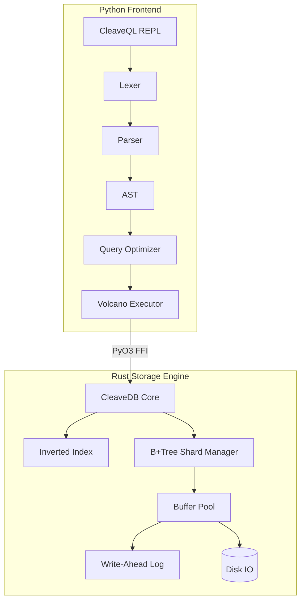

<div align="center">
  <h1>🗡️ CleaveDB 3.0</h1>
  <p><strong>A high-performance, polyglot NoSQL document database with deep graph traversal capabilities.</strong></p>
  
  []()
  []()
  []()
  []()
</div>

<br/>

**CleaveDB 3.0** is an experimental, hybrid NoSQL database built for extreme performance and expressive relationship traversal. It bridges the gap between document flexibility and graph connectivity. The engine is written in **Rust** (with C++ SIMD extensions) for zero-cost abstractions, bounded by a **Python** frontend (PyO3) that powers the heavily optimized **CleaveQL** query language.

---

## ✨ Key Features

- **Blazing Fast Storage Engine:** Custom B+Tree implementation, asynchronous Write-Ahead Logging (WAL) for durability, and a highly concurrent buffer pool memory manager.
- **SIMD-Accelerated Text Search:** Hardware-accelerated term extraction and inverted indexing for lightning-fast full-text search.
- **Graph Relationships (Bonds):** First-class support for linking documents and traversing deep relationships without the expensive overhead of traditional SQL `JOIN`s.
- **CleaveQL:** A completely custom, human-readable, and fully case-insensitive query language built specifically for documents and graphs.
- **Data Pipelines:** Native `FLOW` rules for automated, event-driven data movement across buckets.
- **Polyglot Architecture:** Front-end parser/optimizer in Python, backend storage in Rust, bound tightly via PyO3 for maximum throughput.

## 🏗️ Architecture



## 🚀 Getting Started

### Prerequisites
- **Python 3.8+**
- **Rust** (cargo)
- **maturin** (for building the Python/Rust bindings)

### Installation

Clone the repository and build the native extensions:

```bash
git clone https://github.com/cleavedb/cleavedb.git
cd cleavedb

# Install build tools
pip install maturin

# Build and install the Rust engine wheel
cd storage
maturin build --release
pip install target/wheels/cleavedb3*.whl --force-reinstall
cd ..
```

### Starting the REPL

Launch the interactive CleaveQL shell:

```bash
python cleavedb.py
```

## 📖 CleaveQL Cheat Sheet

CleaveQL is a powerful, completely case-insensitive query language. Here is a quick reference to its core capabilities.

### Document Operations

**Insert Data (Single or Bulk):**
```sql
POUR INTO developers "dev_1" {"name": "Alice", "role": "backend"}

POUR MANY INTO developers [
  {"name": "Bob", "role": "frontend"},
  {"name": "Charlie", "role": "fullstack"}
]
```

**Query / Text Search:**
```sql
SCOOP FROM developers MENTIONING "backend"
```

**Update Data:**
```sql
CHANGE developers "dev_2" SET role TO "lead"
```

**Delete Data:**
```sql
DRAIN developers "dev_3"
```

### Advanced Graph & Structural Operations

**Create an Index:**
```sql
INDEX developers ON (role, status)
```

**Declare a Relationship (Bond):**
```sql
BOND user_orders FROM users.id TO orders.user_id STRICT
```

**Traverse a Graph (Follow):**
```sql
FOLLOW "user_123" THROUGH user_orders DIRECTION BOTH DEPTH 3
```

**Automated Data Pipelines (Flow):**
```sql
SHAPE FLOW FROM users TO active_users WHEN status = "active" ACTION COPY
```

## ⚡ Performance

The system was heavily audited and optimized (Days 1-102 Audit). The Python frontend utilizes a sophisticated Volcano execution model and Plan Enumerator with the following benchmarks:

| Component | Metric (p99) | Throughput |
|-----------|--------------|------------|
| **Lexer/Parser** | 60.9 µs | > 25,000 ops/sec |
| **Query Planner** | 7.8 µs | > 170,000 ops/sec |
| **JSON Serialization** | 3.4 µs | > 300,000 ops/sec |

*Note: The Rust backend performance metrics vary strictly by Disk I/O speeds and allocated buffer pool frames.*

## 🛠️ Development & Testing

To run the end-to-end testing suite validating the entire pipeline (Parser -> Optimizer -> Rust Engine -> Disk):

```bash
python test_e2e.py
```

To test advanced analytical features and AST generation:

```bash
python test_advanced.py
```

## 📄 License

This project is licensed under the MIT License.
