<div align="center">
  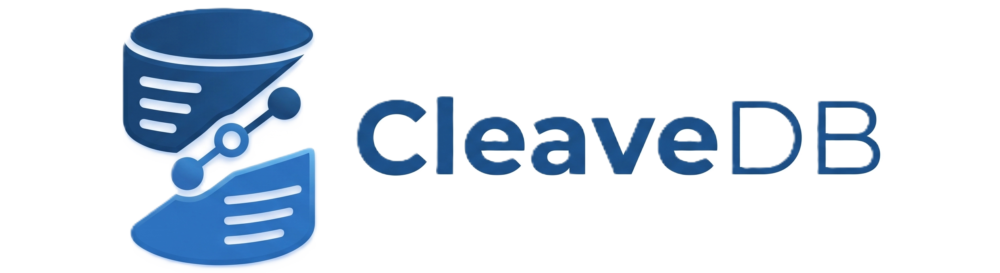
  <br/><br/>
  <p><strong>The polyglot, AVX-512 ready , hybrid relational-document graph database with Transformer attention layers.</strong></p>
  
  
  [](https://www.python.org/downloads/?Python)
  [](https://doc.rust-lang.org/edition-guide/rust-2021/index.html)
  [](https://github.com/Tribrix23/CleaveDB/blob/main/LICENSE)
  [](https://www.npmjs.com/package/cleavedb)
</div>

<br/>

**CleaveDB 4.0.0** is a ground-up, hybrid Relational Document & Graph database that eliminates the complexity of traditional SQL `JOIN`s, external vector search services, and opaque graph databases. It ships with:


- **Native Graph-Relational Links**: Documents are not isolated. They are deeply relational, linked natively through ~10 functional Graph "Bonds" that allow unlimited depth, multi-hop traversals with conversational English, completely eliminating the need for `JOIN`s.
- A high-performance **Rust storage engine** built entirely from scratch — no SQLite, no RocksDB, no external storage libraries.
- **AVX-512 / AVX2 C++ SIMD extensions** exist in the Rust engine (vector search runs on C++ AVX-512 extensions).
- A **Python interpreter frontend** (via PyO3 bindings) that runs the **CleaveQL** query language.
- **Real neural Transformer embeddings** for semantic search via a quantized ONNX model, using ~22MB of RAM.
- A **Go distributed coordinator** (`coordinator.exe`) providing high-concurrency Scatter-Gather query routing and Min-Heap K-Way result merging across cluster shards.
- A **TCP server** (`cleavedb_server.py`) with full authentication, background Cron worker, and **multi-tenant Document-Level Security (DLS)**.

#

## 💾 Installation

### Option A: Download Pre-Compiled Binary (Recommended)
You do **not** need to install Python, Rust, or C++ build tools. We provide a single, self-contained executable that has the hardware-accelerated C++ AVX-512 extensions and Rust engine fully baked in.

1. Go to the [Releases](https://github.com/Tribrix23/CleaveDB/releases) page.
2. Download `CleaveShell.exe` (or the equivalent for your OS).
3. Double-click the executable to start the database server and interactive shell.

> [!NOTE]
> **Windows SmartScreen Notice**
> Because CleaveDB is an independent, open-source project, the Windows installer does not use an expensive corporate EV certificate. When downloading or running the `.exe`, Windows or Edge might flag it as "unrecognized".
> To bypass this, click **Keep -> Keep anyway** in Edge, and **More info -> Run anyway** on the blue Windows screen.

*(You can now execute all CleaveQL queries directly in your terminal, or connect via the NPM Client!)*

---

### Option B: Compile from Source (Advanced / Contributors)
If you want to modify the source code, you can compile the engine from scratch. 

**Prerequisites:**
- **Python 3.10+**
- **Rust Toolchain** (Install via `rustup` from [rustup.rs](https://rustup.rs/))
- **C++ Build Tools** (For compiling the AVX-512 SIMD extensions)
- *(Optional)* **Go** (For distributed cluster coordinator logic)

**1. Install Python Dependencies**
```bash
pip install -r requirements.txt
```

**2. Run the Master Build Script**
Simply run the orchestrator script, which compiles the C++ SIMD layers, the Go Coordinator, and the Rust storage engine via PyO3/maturin:
```bash
python build.py
```

**3. Start the Server**
Once compiled, start the TCP server:
```bash
python cleavedb_server.py
```

#

## 🚀 Quick Start: Connecting to CleaveDB

Note: CleaveQL is **completely case-insensitive** (`FIND users` is the same as `find USERS`).

CleaveDB operates over a **TCP Protocol (port 8300)**, a **WebSocket Protocol (port 8301)**, and an **HTTP REST API (port 8302)**. All client connections must authenticate with a valid username and password before executing CleaveQL queries.

### Python (Raw TCP connection)

```python
import asyncio
import json

async def connect_tcp():
    reader, writer = await asyncio.open_connection('127.0.0.1', 8300)
    
    # 1. Authenticate
    auth_payload = {"action": "login", "username": "david", "password": "perez"}
    writer.write((json.dumps(auth_payload) + "\n").encode())
    await writer.drain()
    
    response = await reader.readline()
    if json.loads(response).get("status") != "ok":
        return print("Auth failed!")
        
    # 2. Run Queries (Newline delimited)
    writer.write(b'FIND users\n')
    await writer.drain()
    
    query_result = await reader.readline()
    print("TCP Query Result:", query_result.decode())

asyncio.run(connect_tcp())
```

### Python (`websockets` library)

```python
import asyncio
import websockets
import json

async def connect_ws():
    async with websockets.connect("ws://127.0.0.1:8301") as ws:
        # 1. Authenticate
        await ws.send(json.dumps({"action": "authenticate", "username": "david", "password": "perez"}))
        auth_res = json.loads(await ws.recv())
        
        if auth_res[0].get("status") != "ok":
            return print("Auth failed!")
            
        # 2. Run Queries
        await ws.send('POUR INTO users "bot" {"name": "AI"}')
        print("WS Query Result:", await ws.recv())

asyncio.run(connect_ws())
```

### Node.js (`ws`)

```javascript
const WebSocket = require('ws');

const ws = new WebSocket('ws://127.0.0.1:8301');

ws.on('open', function open() {
  // 1. Authenticate
  ws.send(JSON.stringify({
    action: 'authenticate', 
    username: 'david', 
    password: 'perez'
  }));
});

let authenticated = false;

ws.on('message', function incoming(data) {
  const response = JSON.parse(data);
  
  if (!authenticated) {
    if (response[0].status === 'ok') {
      authenticated = true;
      // 2. Run Queries
      ws.send('FIND users');
    } else {
      console.error('Auth Failed!');
    }
  } else {
    console.log('Query Result:', response);
  }
});
```

### CLI / Terminal (HTTP & WebSockets)

CleaveDB operates over **both** HTTP (port `8302`) and WebSockets (port `8301`).

For standard REST and raw CleaveQL via HTTP, you can use `curl`:
```bash
curl -X POST http://127.0.0.1:8302/api/v1/query \
  -H "Authorization: Basic ZGF2aWQ6cGVyZXo=" \
  -d "FIND THE TALLY OF users"
```

For real-time Pub/Sub subscriptions (like `LISTEN TO users`), use a websocket tool like `wscat`:

```bash
# Install wscat
npm install -g wscat

# Connect and authenticate
wscat -c ws://127.0.0.1:8301

# Send your credentials
> {"action": "authenticate", "username": "david", "password": "perez"}
< [{"status": "ok", "message": "Authenticated as david"}]

# Run a query
> FIND users
< [{"status": "ok", "documents": [...]}]
```


## 🏗️ Architecture & Toolchain

```
┌─────────────────────────────────────────────────────────┐
│                  CleaveQL (Python Layer)                │
│   Lexer ──► Parser ──► AST ──► Interpreter             │
│         attention/sra.py  ─── ONNX Q8 Transformer      │
│         cleaveql/security.py ── GBAC / DLS / Masking   │
│         cleaveql/cost_model.py ── Query Cost Estimation │
└────────────────────────┬────────────────────────────────┘
                         │  PyO3 FFI
┌────────────────────────▼────────────────────────────────┐
│              Rust Storage Engine                        │
│   BPlusTree ── WAL (Group Commit) ── Buffer Pool        │
│   Bloom Filter ── LZ4 Page Compression ── AES-256-GCM  │
│   SIMD FFI: AVX-512 dot_product, softmax, gelu, matmul │
│   Go Coordinator ── coordinator.exe (Scatter-Gather & K-Way Merge)    │
└─────────────────────────────────────────────────────────┘
```

### Toolchain Components

| Layer | Technology | Component | Description |
|---|---|---|---|
| **Storage** | Rust 2021 | `storage/src/` | Hand-built B+Tree, 16KB pages with CRC32, CLOCK-sweep buffer pool, WAL with group commit, Bloom filters, AES-256-GCM at-rest encryption |
| **SIMD** | C++ (AVX-512/AVX2) | `simd/src/` | Fully wired to C++ AVX-512 extensions for dot-product, softmax, GELU, sigmoid, layer norm, matrix multiply. Auto-fallback to scalar on unsupported CPUs |
| **Coordinator** | Go 1.22+ | `coordinator/src/` | Standalone high-concurrency microservice (`coordinator.exe`) listening on :8305. Performs parallel TCP query distribution and K-Way Min-Heap result merging across shards |
| **Interpreter** | Python 3.13 | `cleaveql/` | Recursive-descent parser producing ~38 AST node types, security policy engine (GBAC + RBAC + DLS + Masking) |
| **AI Search** | ONNX Runtime | `attention/sra.py` | Semantic Relevance Attention — quantized `all-MiniLM-L6-v2` Transformer generating 384-dim embeddings, cosine similarity ranking |
| **Bindings** | PyO3 / Maturin | `storage/src/python.rs` | Rust↔Python bridge exposing `pour`, `get`, `scan_bucket`, `delete`, `heal`, `show` |

---

## 🚀 Getting Started

The easiest way to get started is to download the pre-compiled executable from the [Releases](https://github.com/Tribrix23/CleaveDB/releases) page. This requires **zero dependencies**—no Python, no Rust, and no C++ tools.

If you are a developer compiling from source, you can build the native extensions by running:
```bash
pip install -r requirements.txt
python build.py
python cleavedb_server.py
```

---

## 🔒 Authentication & Multi-Tenancy

CleaveDB enforces authentication before any query. Every client must `register` or `login` through the CLI shell.

### Registration
```
cleavedb-auth> register
Username: david
Password: ********
Dev Password (superuser override): ********
Security Question: What was the name of your first pet?
Answer: rover
```
Passwords are hashed with **PBKDF2-HMAC-SHA256** (100,000 iterations, 16-byte random salt). Security questions and answers are encrypted at rest with **AES-256-GCM** via a Fernet key (`cleavedb.key`).

### Login (Dual Privilege Levels)
```
cleavedb-auth> login
Username: david
Password: ********           → Standard user prompt: david@cleavedb>
Password: <dev_password>     → Dev superuser prompt: root@cleavedb>
```
- **Standard users** can read/write their own data.
- **Dev superusers** can additionally access hidden system buckets (`_auth`, `_cron`, `_bonds`, `_security_policies`).

### Password Recovery
```
cleavedb-auth> forgot
Username: david
→ Server returns decrypted security question
Answer: rover
New Password: ********
```

### Multi-Tenant Isolation
Every document, bond, and security policy is **automatically namespaced** with the creator's tenant ID:

```
david@cleavedb> POUR INTO products "laptop" {"price": 999}
→ Stored as: products:david.laptop

john@cleavedb> FIND products
→ Returns: [] (zero results — John cannot see David's data)
```

Document-Level Security (DLS) filtering is enforced at the engine level on every scan. Even a Dev Superuser logged in as John **cannot** see David's documents.

---

## 📖 Complete CleaveQL Reference

CleaveDB defines **25+ commands** with **~150 token types** producing **~38 AST node types**. Every query reads like natural English.

---

### 4. POUR - Insert / Upsert Documents

<div align="center">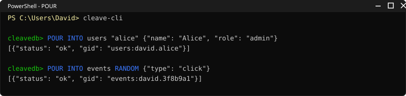</div>

```sql
POUR INTO <bucket> "<id>" {json}
POUR INTO <bucket> "<id>" {json} EXPIRES IN <int> [SECONDS|MINUTES|HOURS|DAYS]
POUR INTO <bucket> RANDOM {json}
POUR INTO <bucket> "<id>" {json}
POUR INTO <bucket> "<id>" {json} EXPIRES IN <int> [SECONDS|MINUTES|HOURS|DAYS] WITH SECRET "<password>"
POUR MANY INTO <bucket> [{json}, {json}, ...]
POUR {json} INSIDE <bucket> "<id>" AT <field.path>
```

| Modifier | Description |
|---|---|
| `RANDOM` | Auto-generates a cryptographic 64-bit hex ID |
| `WITH SECRET "<pw>"` | Hashes password via PBKDF2 and creates an `_auth` entry — registers a sub-user account |
| `MANY` | Bulk-inserts an array of documents in one statement |
| `INSIDE ... AT <path>` | Injects JSON into a nested field path of an existing document |

**Examples:**
```sql
POUR INTO users "alice" {"name": "Alice", "age": 28, "role": "admin"}
POUR INTO events RANDOM {"type": "click", "page": "/home"}
POUR INTO users "bob" {"name": "Bob", "role": "viewer"} WITH SECRET "bobpass123"
POUR MANY INTO products [{"gid": "p1", "name": "Laptop"}, {"gid": "p2", "name": "Phone"}]
POUR {"tool": "CleaveDB"} INSIDE users "alice" AT profile.skills
```

---

### 5. FIND / SCOOP - Query & Retrieve Documents

<div align="center">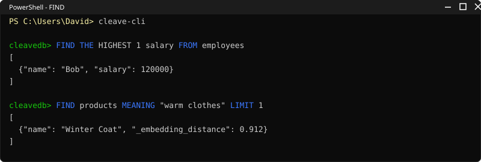</div>

`FIND` is the primary read verb (alias: `SCOOP`). It supports **10 query modes** and **12 chainable modifiers**.

#### Query Modes

| Mode | Syntax | Description |
|---|---|---|
| `EVERYTHING` | `FIND <bucket>` | Default — returns all matching documents |
| `FIRST` | `FIND THE FIRST <n> FROM <bucket>` | First N documents |
| `LAST` | `FIND THE LAST <n> FROM <bucket>` | Last N documents |
| `TALLY` | `FIND THE TALLY OF <bucket>` | Document count |
| `TOTAL` | `FIND THE TOTAL <field> FROM <bucket> GROUPED BY <field>` | Grouped summation |
| `HIGHEST` | `FIND THE HIGHEST <n> <field> FROM <bucket>` | Top N by field (descending) |
| `LOWEST` | `FIND THE LOWEST <n> <field> FROM <bucket>` | Bottom N by field (ascending) |
| `UNIQUE` | `FIND ONLY UNIQUE <field> FROM <bucket>` | Distinct values for a field |
| `RELATED` | `FIND "<label>" OF "<source_id>"` | Direct graph bond traversal |
| `CHAIN` | `FIND THE <rel1> OF THE <rel2> OF <bucket> "<id>"` | Multi-hop deep graph traversal |

#### Chainable Modifiers (combine in any order)

| Modifier | Syntax | Description |
|---|---|---|
| `WHERE` | `WHERE <field> <op> <value> [AND/OR ...]` | Boolean predicate filtering (`=`, `!=`, `>`, `<`, `>=`, `<=`, `IS`, `IS NOT`) |
| `WHOSE` | `WHOSE <field> IS <value>` | Exact field match (easy English) |
| `MENTIONING` | `MENTIONING "<text>"` | Full-text keyword substring search |
| `MEANING` | `MEANING "<text>"` | AI vector semantic search (ONNX Transformer) |
| `MATCHING` | `MATCHING "<json>"` | JSON structural template matching (🔜) |
| `INCLUDE` / `WITH` | `WITH <field1>, <field2>` | Eager join of related documents (🔜) |
| `YIELD` / `SHOW` | `SHOW <field1>, <field2>` | Field projection (return only these fields) |
| `ARRANGED BY` | `ARRANGED BY <field> GOING UP/DOWN` | Sort results (aliases: `SORTED BY`, `ORDER BY`, `ASC`/`DESC`) |
| `LIMIT` | `LIMIT <n>` | Restrict number of results |
| `GROUPED BY` | `GROUPED BY <field>` | Grouping for aggregations |
| `AS OF` | `AS OF "<timestamp>"` / `AS OF yesterday` | Time-travel historical query |
| `CANDIDATE` | `FIND CANDIDATE "<label>" OF "<id>"` | Include dormant conditional bonds |

**Examples:**
```sql
FIND products
FIND products WHERE price > 50 AND category = "Electronics"
FIND products WHOSE category IS "Books" ARRANGED BY price GOING DOWN LIMIT 5
FIND products MENTIONING "wireless headphones"
FIND products MEANING "something warm for cold weather" LIMIT 3
FIND THE TALLY OF users
FIND THE HIGHEST 5 salary FROM employees
FIND ONLY UNIQUE department FROM employees
FIND THE TOTAL revenue FROM sales GROUPED BY region
FIND THE FIRST 10 FROM logs
FIND EVERYTHING FROM users SHOW name, email
```

---

### 6. CHANGE / UPDATE - Partial Update Documents

<div align="center">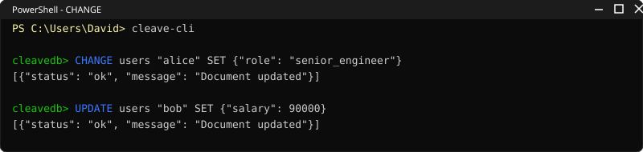</div>

```sql
CHANGE "<doc_id>" IN <bucket> TO <field> = <value>
CHANGE <bucket> "<doc_id>" SET <field> TO <value>
CHANGE <bucket> "<doc_id>" SET <field1> TO <val1>, <field2> TO <val2>
```

**Sub-Scoop injection** — dynamically set a field from another query's result:
```sql
CHANGE teams "devs" SET new_hires TO (SCOOP EVERYTHING FROM users WHOSE role IS "developer")
```

If updating the `secret` field, CleaveDB automatically re-hashes the password in `_auth`.

---

### 7. DRAIN - Soft-Delete Documents

<div align="center">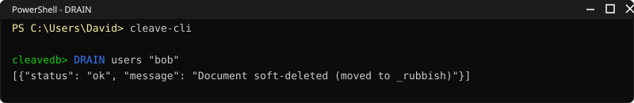</div>

Moves documents to the `_rubbish` bin (auto-purged after 3 days by the Cron Worker).

```sql
DRAIN <bucket> "<doc_id>"
DRAIN <bucket> WHERE <predicates> 🔜
DRAIN <bucket> BEFORE "<datetime>" 🔜
```

Cascading: if the drained document has bonds marked `ON DELETE CASCADE`, all bonded targets are also drained.

---

### 8. SALVAGE - Restore from Rubbish

<div align="center">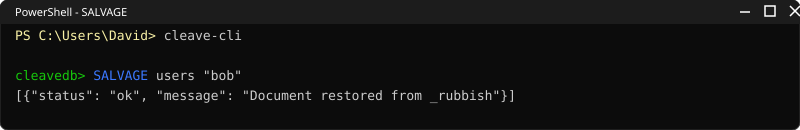</div>

```sql
SALVAGE "<doc_id>" FROM _rubbish
SALVAGE EVERYTHING FROM _rubbish
```

---

### 9. INCINERATE - Permanently Destroy

<div align="center">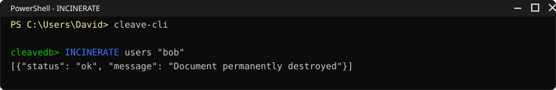</div>

```sql
INCINERATE "<doc_id>" FROM _rubbish
INCINERATE EVERYTHING FROM _rubbish
```

---

### 10. LINK / BOND - Rich Graph Relationships

<div align="center">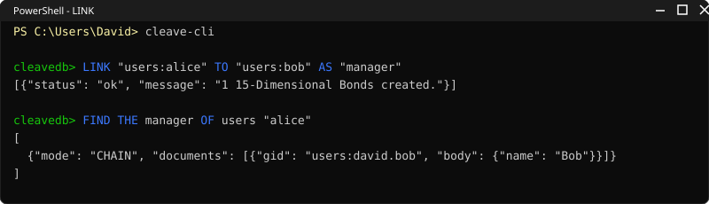</div>

CleaveDB bonds are not just static pointers — they are richly configurable relationship objects with up to **~10 functional attributes**.

```sql
LINK "<source>" TO "<target>" AS "<label>"
LINK "<source>" TO "<target>" AS MUTUAL "<label>"
LINK "<source>" TO ANY("<t1>", "<t2>") AS "<label>"
```

#### All Bond Modifiers

| Modifier | Syntax | Description |
|---|---|---|
| `MUTUAL` | `AS MUTUAL "<label>"` | Creates bidirectional bonds (both directions) |
| `EXCLUSIVELY` | `EXCLUSIVELY` | Expires all prior active bonds with the same source + label |
| `CASCADE` | `ON DELETE CASCADE` | Automatically deletes target when source is drained |
| `CONFIDENCE` | `WITH CONFIDENCE <float>` | Probabilistic edge weight (0.0–1.0) |
| `AFFINITY` | `WITH AFFINITY <float>` | Relationship strength weight (0.0–1.0) |
| `EXPIRING IN` | `EXPIRING IN <n> HOURS/MINUTES` | Ephemeral time-bound bond with TTL |
| `CONDITION` | `IF <subject> <field> IS <value>` | Conditional/dormant bond — only active when condition is true |
| `THROUGH` | `THROUGH "<node>"` | Routes edge through an intermediate node |
| `ANY` | `TO ANY("<id1>", "<id2>")` | Multi-target — creates bonds to multiple targets |

Condition subjects: `source`, `target`, `their`, `its`, `his`, `her`, `my`

**Examples:**
```sql
LINK "users:alice" TO "users:bob" AS MUTUAL "friend"
LINK "users:alice" TO "session:s1" AS "active_session" EXPIRING IN 1 HOUR
LINK "order:5521" TO "users:alice" ON DELETE CASCADE
LINK "doc:1" TO "topic:ai" AS "tagged" WITH CONFIDENCE 0.94
LINK "users:bob" TO "product:shoes" AS "interested" WITH AFFINITY 0.87
LINK "users:alice" TO "project:x" AS "member" EXCLUSIVELY
LINK "users:alice" TO "file:secret.pdf" AS "can_read" IF target clearance IS "public"
```

---

### 11. SEVER / UNLINK - Destroy Graph Bonds

<div align="center">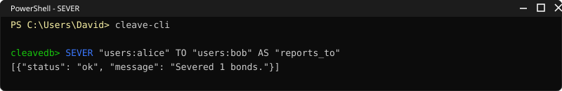</div>

```sql
SEVER "<source>" FROM "<target>" AS "<label>"
SEVER "<source>" FROM "<target>"
```

---

### 12. DROP SECURITY - Remove Security Policies & Masks

<div align="center">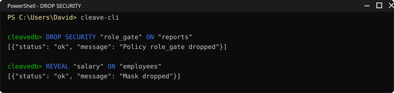</div>

```sql
DROP SECURITY "<name>" ON <bucket>
```

Removes both the named policy and any field mask matching that name on the bucket — from memory and from persistent storage.

---

### 13. Graph Traversal — Single-Hop & Multi-Hop

<div align="center">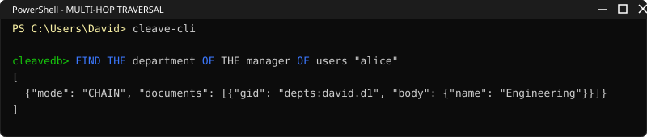</div>

**Direct lookup (1 hop):**
```sql
FIND "friend" OF "users:alice"
```

**Deep chain traversal (N hops):**
```sql
FIND THE friend OF THE friend OF users "alice"
FIND THE manages OF THE manages OF THE manages OF org "ceo"
```

**Alternative chain syntax:**
```sql
TRACE "friend", "friend" FROM "users:alice"
```

**Bond metadata query:**
```sql
FIND RELATED "friend" FROM "users:alice"
FIND CANDIDATE "can_read" OF "users:bob"
```

**Time-travel bonds:**
```sql
FIND "friend" OF "users:alice" AS OF yesterday
FIND "friend" OF "users:alice" AS OF "1690000000"
```

---

### 14. Data-Level Security (GBAC, RBAC & Masking)

<div align="center">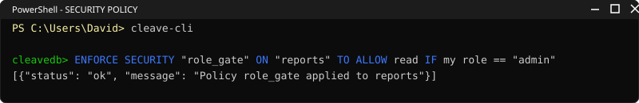</div>

CleaveDB has a native policy engine supporting **Graph-Based Access Control (GBAC)**, **Role-Based Access Control (RBAC)**, and **Dynamic Field Masking** — all evaluated inside the interpreter before any data reaches the client.

#### Security Policies
```sql
ENFORCE SECURITY "owner_only" ON "documents" TO ALLOW read IF bonded as "owner" to my user_id
ENFORCE SECURITY "role_gate" ON "reports" TO ALLOW write IF my role = "admin"
SHAPE POLICY "dept_filter" ON "employees" FOR READ USING department IS @user_department
```

#### Field Masking

<div align="center">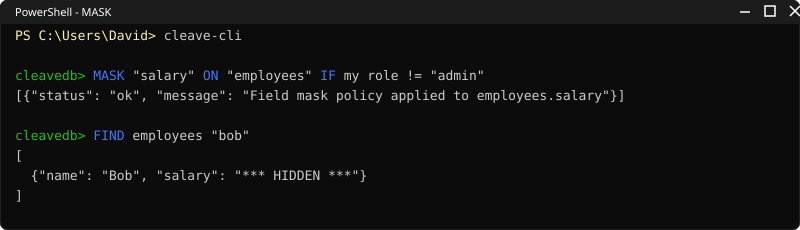</div>

```sql
MASK "salary" ON "employees" IF my role IS NOT "admin"
MASK "ssn" ON "patients" IF my role IS NOT "doctor"
SHAPE MASK email ON users USING role IS NOT @role
```
Masked fields are **completely stripped** from the JSON response — never sent over the wire.

#### Dynamic Removal
```sql
DROP SECURITY "owner_only" ON "documents"
DROP SECURITY "salary" ON "employees"
```

#### Session Context
```sql
SET user = "alice"
SET role = "admin"
AUTHENTICATE AS "bob"
```

#### Security Condition Patterns
| Pattern | Example | Description |
|---|---|---|
| **RBAC** | `IF my role = "admin"` | Checks session role against literal |
| **GBAC** | `IF bonded as "owner" to my user_id` | Checks live graph bond between document and session user |
| **Field Match** | `IF department IS @user_department` | Compares document field to context variable |
| **Context Match** | `IF @role != "viewer"` | Compares context variable to literal |

---

### 15. Memory Eviction Policies

```sql
ENFORCE POLICY ON <bucket> TO OVERWRITE CURRENT
ENFORCE POLICY ON <bucket> TO REPLACE OLDEST UPDATES
ENFORCE POLICY ON <bucket> TO REPLACE LEAST RECENTLY USED
```

The **LRU** policy tracks read/write timestamps per document and automatically evicts the least-recently-used document when a bucket reaches capacity (100 docs).

---

### 16. AI Semantic Search (`MEANING`)

<div align="center">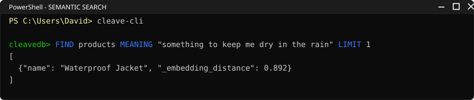</div>

CleaveDB ships with a built-in neural Transformer for vector search — no external services required.

**How it works:**
1. The quantized `all-MiniLM-L6-v2` ONNX model (~22MB) is pre-bundled directly in the `attention/model/` directory. It is 100% offline.
2. When a `MEANING` query arrives, the engine embeds the search phrase into a 384-dimensional vector (<5ms).
3. Cosine similarity is computed against every document's text content.
4. Results are ranked by `_embedding_distance` (0.0–1.0) and filtered at a 0.20 threshold.

```sql
FIND products MEANING "something warm for cold weather" LIMIT 3
```
```json
{
  "documents": [
    { "gid": "products:david.coat", "body": {"name": "Thick Wool Coat"}, "_embedding_distance": 0.57 },
    { "gid": "products:david.scarf", "body": {"name": "Winter Scarf"}, "_embedding_distance": 0.49 }
  ]
}
```
No keyword overlap needed — the Transformer understands semantic meaning.

---

### 17. Time-Travel Queries (MVCC)

<div align="center">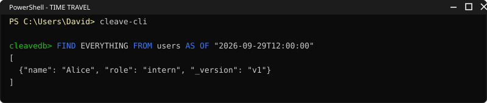</div>

Every document modification shadows a historical snapshot into `_history_<bucket>`. Note: `AS OF` only works on BOND queries (mode RELATED), not on standard document scans.

```sql
FIND EVERYTHING FROM users AS OF yesterday
FIND "friend" OF "users:alice" AS OF "1690000000"
```

---

### 18. Background Cron Worker

<div align="center">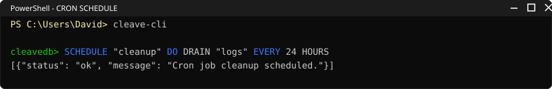</div>

CleaveDB runs a background `asyncio` coroutine that executes scheduled tasks — no external job scheduler needed.

```sql
EVERY 5 SECONDS DO (SCOOP THE TALLY OF users)
EVERY 1 HOUR DO (DRAIN sessions WHERE expired = true)
EVERY DAY AT MIDNIGHT DO (INCINERATE EVERYTHING FROM _rubbish)
```

The Cron Worker also **auto-purges** documents in `_rubbish` older than 3 days.

---

### 19. Bucket Configuration (`SHAPE`)

<div align="center">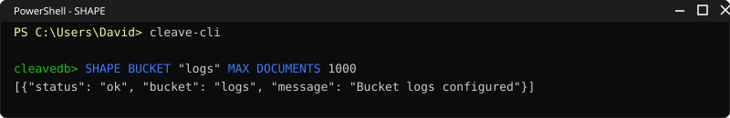</div>

```sql
SHAPE BUCKET logs COMPRESSION lz4  TTL 86400  MAX DOCUMENTS 10000 VERSIONED 
SHAPE PROJECTION active_users FROM users WHERE status = "active" 🔜
SHAPE FLOW FROM orders TO archive WHEN status = "completed" ACTION MOVE 
```

---

### 20. Indexes

<div align="center">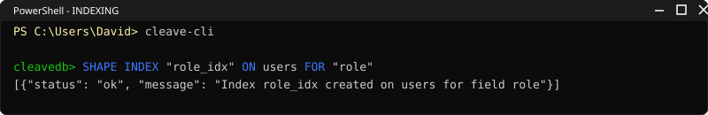</div>

```sql
INDEX users ON (role, department) 
```
Creates a compound B+Tree secondary index for O(log N) lookups.

---

### 21. Diagnostics & Metadata

<div align="center">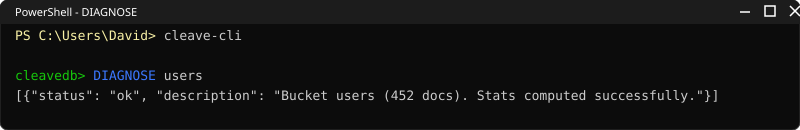</div>

```sql
SHOW BUCKETS                    -- List all active buckets
SHOW BONDS                      -- List all graph bonds
SHOW INDEXES                    -- List all indexes
SHOW STATS                      -- Engine statistics
DESCRIBE users                  -- Bucket document count and field stats
DESCRIBE MEANING                -- Built-in tutorial for semantic search
HEAL ALL                        -- Rebuild all indexes and bonds
HEAL BONDS                      -- Repair bond graph structure
HEAL INDEXES                    -- Rebuild secondary indexes
PEER INTO (FIND products)       -- Print internal execution plan
PEER INTO ATTENTION             -- Inspect attention mechanism stats 🔜
SUGGEST BONDS                   -- AI-suggested missing relationships 🔜
```

---

### 22. Aggregation Pipeline (`DISTILL`) 

<div align="center">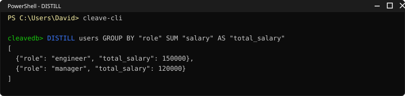</div>

```sql
DISTILL FROM employees TOTAL OF salary
DISTILL FROM scores AVERAGE OF points
DISTILL FROM products MIN OF price
DISTILL FROM products MAX OF price
DISTILL FROM metrics SPREAD OF latency
```

Supported functions: `TOTAL`, `AVERAGE`, `MIN`, `MAX`, `SPREAD`

---

### 23. Graph Traversal (`FOLLOW`) 

<div align="center">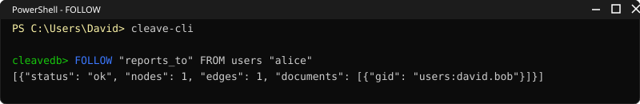</div>

Legacy graph API with full traversal control:

```sql
FOLLOW "users:alice" THROUGH "friend" DIRECTION BOTH DEPTH 3 LIMIT 10
FOLLOW "users:alice" DIRECTION OUT DEPTH 1
```

| Modifier | Description |
|---|---|
| `THROUGH <bond>` | Traverse only bonds with this label |
| `DIRECTION OUT/IN/BOTH` | Edge traversal direction |
| `DEPTH <n>` | Maximum hop depth |
| `LIMIT <n>` | Maximum returned documents |

---


### 24. ACID Transactions (`BEGIN` / `COMMIT`)
CleaveDB supports full, multi-step ACID transactions (Atomicity, Consistency, Isolation, Durability) running via Software Transactional Memory (STM). Transactions buffer in the engine and commit atomically. If any execution error occurs (e.g., Syntax Error, Security Violation), the database automatically rolls back all previous statements in the block.

<div align="center">
  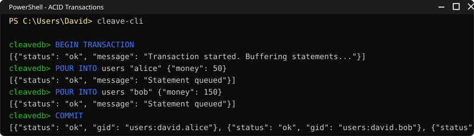
</div>

```sql
BEGIN TRANSACTION
POUR INTO users "alice" {"money": 50}
POUR INTO users "bob" {"money": 150}
COMMIT
```
Or rollback manually:
```sql
ROLLBACK
```

### 25. Database Triggers (`ON ... RUN`)
Execute background CleaveQL queries automatically in response to database mutations. Variables like `$gid` and JSON keys (e.g., `$amount`) are dynamically interpolated.

<div align="center">
  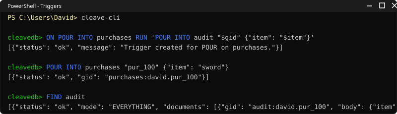
</div>

```sql
ON POUR INTO purchases RUN 'POUR INTO audit "$gid" {"action": "item_purchased", "item": "$item"}'
```


### 26. Schema Migration (`MIGRATE`)

<div align="center">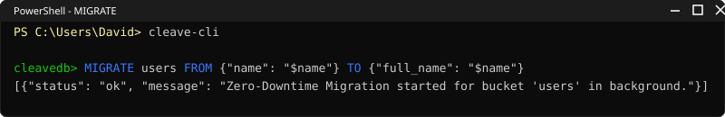</div>

Fully working zero-downtime schema migration:

```sql


MIGRATE <bucket> FROM <src_json> TO <dst_json>
```

### 27. Rate Limiting (`LIMIT QUERIES`)

<div align="center">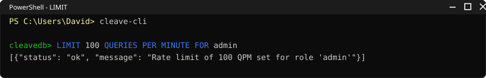</div>

Fully working rate limiting:

```sql


LIMIT <n> QUERIES PER MINUTE FOR <role>
```

### Phase 2: Native HTTP REST API (`http://localhost:8302/api/v1`)
CleaveDB now supports zero-dependency REST requests alongside TCP and WebSockets. You can run raw CleaveQL queries via HTTP POST, or use standard RESTful routing. Authentication is handled via Basic Auth (`username:password`).

**1. Raw CleaveQL via HTTP:**
```bash
curl -X POST http://127.0.0.1:8302/api/v1/query \
  -H "Authorization: Basic ZGF2aWQ6cGVyZXo=" \
  -d "FIND THE TALLY OF users"
```

**2. Standard RESTful CRUD Operations:**
- **GET** `/api/v1/users` -> `FIND users`
- **GET** `/api/v1/users/alice` -> `FIND users "alice"`
- **POST** `/api/v1/users` -> `POUR INTO users RANDOM {body}`
- **PUT** `/api/v1/users/alice` -> `POUR INTO users "alice" {body}`
- **PATCH** `/api/v1/users/alice` -> `CHANGE users "alice" SET {body}`
- **DELETE** `/api/v1/users/alice` -> `DRAIN users "alice"`

Example POST:
```bash
curl -X POST http://127.0.0.1:8302/api/v1/users \
  -H "Authorization: Basic ZGF2aWQ6cGVyZXo=" \
  -d '{"name": "API User", "age": 25}'
```

## ⚔️ Complete Language Alias Table

CleaveQL provides natural-language aliases so you can write queries the way you think:

| Alias | Canonical | Context |
|---|---|---|
| `FIND` | `SCOOP` | Query verb |
| `TRACE` | `SCOOP CHAIN` | Multi-hop traversal |
| `COUNT` | `SCOOP TALLY` | Document counting |
| `UPDATE` | `CHANGE` | Partial mutation |
| `LINK` | `BOND` | Create relationship |
| `UNLINK` | `SEVER` | Destroy relationship |
| `SORTED BY` | `ARRANGED BY` | Result ordering |
| `ORDER BY` | `ARRANGED BY` | Result ordering |
| `ASC` | `GOING UP` | Sort direction |
| `DESC` | `GOING DOWN` | Sort direction |
| `WITH <fields>` | `INCLUDE <fields>` | Eager joins |
| `SHOW <fields>` | `YIELD <fields>` | Field projection |
| `IF` | `ONLY WHEN` | Bond conditions |

---

## 🔧 TCP Server & Wire Protocol

```bash
python cleavedb_server.py          # Starts on 127.0.0.1:8300
python cleave_cli.py -H 127.0.0.1 -p 8300
```

---

### 28. Realtime Subscriptions (LISTEN)

<div align="center">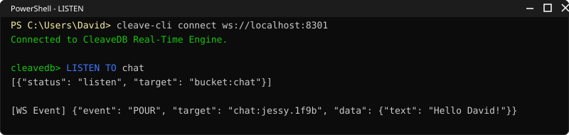</div>

Turn CleaveDB into a realtime Pub/Sub message broker! Connect a WebSocket client to port 8301 and subscribe to specific documents or entire buckets. Any POUR, CHANGE, or LINK executed on the database will instantly push JSON events to your frontend.

`sql
LISTEN TO <bucket> ["<target_id>"]
`

**Examples:**
- LISTEN TO chat - Subscribe to all events in the chat bucket.
- LISTEN TO users "david" - Subscribe exclusively to updates on David's profile.

#### Interactive Chat Demo
To see the full power of real-time CleaveQL subscriptions in action, we included a highly-responsive interactive CLI chat simulation using purely CleaveDB WebSockets (complete with real-time Facebook Messenger style typing indicators!).

<div align="center">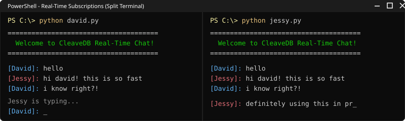</div>

**Try it out yourself:**
1. Start the server: python cleavedb_server.py
2. Open terminal 1: python tests/websocket/david.py
3. Open terminal 2: python tests/websocket/jessy.py

Type a message in one terminal and watch it appear instantly in the other!

---

### 29. Ephemeral Data & Time-To-Live (TTL)

<div align="center">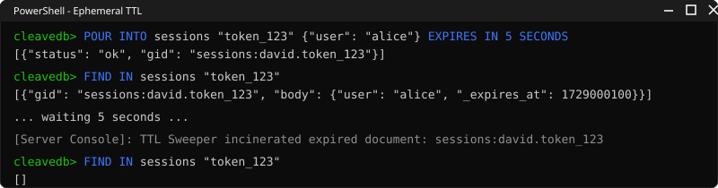</div>

CleaveDB includes a native background Garbage Collector that can automatically hard-delete documents after a specified time period without relying on external cron jobs or scripts.

`sql
POUR INTO <bucket> "<id>" {json} EXPIRES IN <int> [SECONDS|MINUTES|HOURS|DAYS]
`

**Examples:**
- POUR INTO sessions "token_123" {"user": "alice"} EXPIRES IN 5 MINUTES
- POUR INTO verification RANDOM {"code": 5555} EXPIRES IN 24 HOURS

The database automatically computes the exact UNIX epoch expiration and injects a hidden _expires_at field into the document. The background cleavedb_server.py cron worker sweeps the indexing buckets every 5 seconds and incinerates expired data in O(1) time.

### Client Lifecycle
1. **Authentication Phase** → `register` / `login` / `forgot`
2. **Query Phase** → Raw CleaveQL strings, one per line
3. **Disconnection** → `logout` closes session; `exit` terminates CLI

### Wire Protocol

<div align="center">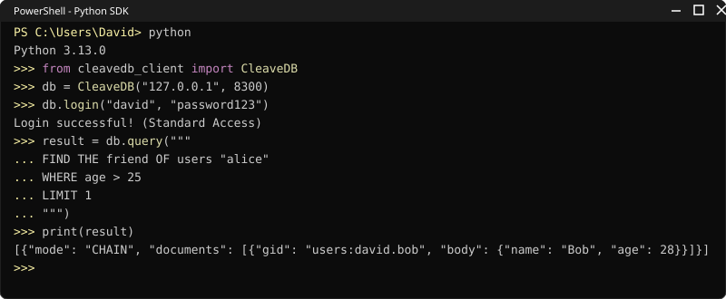</div>

All messages are newline-delimited. Request: raw CleaveQL string + `\n`. Response: JSON array.

```
→  FIND THE TALLY OF users\n
←  [{"status": "ok", "mode": "TALLY", "count": 42}]
```

### CLI Built-in Commands
| Command | Description |
|---|---|
| `cluster <query>` | Scatter query across shards via Go Coordinator on :8305 |
| `cluster status` | Check Go Coordinator shard health and topology |
| `help` / `?` | Print the complete CleaveQL manual |
| `logout` | Close session, return to login screen |
| `cls` / `clear` | Clear terminal screen |
| `exit` / `quit` | Close connection and exit |

---

## 📂 Project Structure

```
dsc/
├── storage/                  # Rust storage engine (maturin + PyO3)
│   └── src/
│       ├── lib.rs            # Module root & public exports
│       ├── page.rs           # 16KB page with CRC32 checksum
│       ├── buffer_pool.rs    # CLOCK-sweep page cache
│       ├── wal.rs            # Write-ahead log, group commit
│       ├── btree/            # Persistent B+Tree
│       ├── bloom.rs          # Bloom filter
│       ├── crypto.rs         # AES-256-GCM at-rest encryption
│       ├── simd_ffi.rs       # AVX-512/AVX2 C++ FFI bindings
│       ├── engine/           # Database, ShardManager, InvertedIndex
│       │   ├── operations.rs # put/get/delete with bond enforcement
│       │   └── volcano.rs    # Volcano-model query executor
│       └── python.rs         # PyO3 Python bindings
│
├── cleaveql/                 # CleaveQL query language frontend
│   ├── lexer.py              # Tokenizer (~150 token types)
│   ├── tokens.py             # Token type enum
│   ├── parser.py             # Recursive descent parser → ~38 AST nodes
│   ├── ast.py                # AST node definitions
│   ├── interpreter.py        # AST executor with DLS & auto-namespacing
│   ├── security.py           # GBAC + RBAC + Field Masking policy engine
│   ├── cost_model.py         # Query cost estimation
│   └── repl.py               # Interactive REPL
│
├── attention/                # AI Transformer attention modules
│   ├── sra.py                # Semantic Relevance Attention (ONNX Q8_0)
│   └── __init__.py           # QUA, SRA, BDA, AQP layer registry
│
├── coordinator/              # Go distributed coordinator service
│   ├── coordinator.exe       # Standalone compiled binary (:8305)
│   └── src/
│       ├── main.go           # High-concurrency TCP Scatter-Gather server
│       └── merge.go          # K-Way merge via min-heap O(N log K)
│
├── simd/                     # C++ SIMD vector extensions
│   └── src/
│       ├── math_ops.cpp      # dot_product (AVX-512 4× unrolled FMA, AVX2, scalar)
│       ├── activations.cpp   # GELU, sigmoid, softmax
│       ├── matmul.cpp        # Matrix multiplication
│       ├── bloom.cpp         # SIMD-accelerated Bloom filter
│       └── attention.cpp     # Attention score computation
│
├── benchmarks/               # Performance benchmark suite
│   └── run.py
│
├── cleavedb_server.py        # TCP server, auth shell, cron worker, multi-tenant DLS
├── cleave_cli.py             # Command-line client with colored prompts
├── build.py                  # Multi-language build orchestrator
└── README.md
```

---

## 📋 Quick Reference Card

```
┌─────────────────────── MUTATIONS ────────────────────────┐
│ POUR INTO bucket "id" {json}                             │
│ POUR INTO bucket "id" {json} WITH SECRET "pw"            │
│ POUR MANY INTO bucket [{...}, {...}]                     │
│ CHANGE bucket "id" SET field TO value                    │
│ DRAIN bucket "id"                                        │
│ SALVAGE "id" FROM _rubbish                               │
│ INCINERATE "id" FROM _rubbish                            │
├─────────────────────── QUERIES ──────────────────────────┤
│ FIND bucket [WHERE/WHOSE/MENTIONING/MEANING] [LIMIT n]  │
│ FIND THE TALLY OF bucket                                 │
│ FIND THE HIGHEST n field FROM bucket                     │
│ FIND THE LOWEST n field FROM bucket                      │
│ FIND ONLY UNIQUE field FROM bucket                       │
│ FIND THE TOTAL field FROM bucket GROUPED BY field        │
│ FIND EVERYTHING FROM bucket ARRANGED BY field GOING DOWN │
├─────────────────────── GRAPH ────────────────────────────┤
│ LINK "src" TO "tgt" AS [MUTUAL] "label" [modifiers]     │
│ SEVER "src" FROM "tgt" AS "label"                        │
│ FIND "label" OF "source_id"                              │
│ FIND THE rel1 OF THE rel2 OF bucket "id"                 │
├─────────────────────── SECURITY ─────────────────────────┤
│ ENFORCE SECURITY "name" ON "bucket" TO ALLOW r/w IF cond │
│ MASK "field" ON "bucket" IF condition                    │
│ DROP SECURITY "name" ON "bucket"                         │
├─────────────────────── INFRA ────────────────────────────┤
│ EVERY n SECONDS DO (command)                             │
  │ DROP BUCKET name                                         │
│ SHAPE BUCKET name [COMPRESSION/TTL/MAX/VERSIONED]        │
  │ SHAPE VIEW name AS CONTINUOUS DISTILL FROM ...           │
  │ FOLLOW target THROUGH bond AS OF time DEPTH n            │
  │ FIND HOW THE bond OF target CHANGED BETWEEN t1 AND t2    │
│ INDEX bucket ON (field1, field2)                          │
│ SHOW BUCKETS / BONDS / INDEXES / STATS                   │
│ DESCRIBE bucket                                          │
│ HEAL ALL / BONDS / INDEXES                               │
└──────────────────────────────────────────────────────────┘
```

---

### 30. Subgraph Pattern Matching (English Syntax)

<div align="center">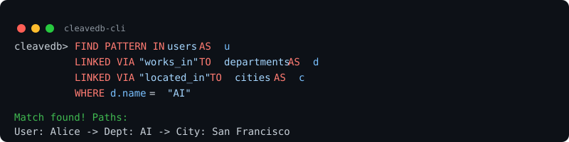</div>

CleaveDB supports an elegant English syntax for traversing complex, multi-hop subgraphs instead of cryptic symbols.

`sql
FIND PATTERN IN users AS u LINKED VIA "works_in" TO departments AS d LINKED VIA "located_in" TO cities AS c WHERE d.name = "AI"
`

This seamlessly returns matching structural paths from the document graph, traversing nodes across different buckets!

---

### 31. Multi-Node Raft Consensus (High Availability Cluster)

<div align="center">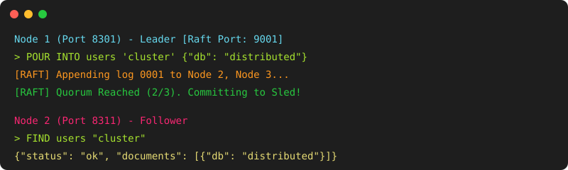</div>

CleaveDB is fully distributed. Using a custom Python-native **Raft Consensus** implementation powered by pysyncobj, CleaveDB provides Zero-Downtime, Disaster Survival, and High Availability replication.

**Run multiple nodes to form a cluster:**
`ash
python cleavedb_server.py --port 8301 --raft-port 8311 --peers 127.0.0.1:8321,127.0.0.1:8331 --data node1
python cleavedb_server.py --port 8311 --raft-port 8321 --peers 127.0.0.1:8311,127.0.0.1:8331 --data node2
python cleavedb_server.py --port 8321 --raft-port 8331 --peers 127.0.0.1:8311,127.0.0.1:8321 --data node3
`

When you send a POUR or CHANGE write command to the cluster:
1. The Leader node intercepts it.
2. The command is mathematically appended to the distributed Raft Log.
3. Once the majority (Quorum) acknowledges writing the WAL, it is committed to memory.
4. If a node crashes, the cluster seamlessly elects a new leader with no data loss!

*Note: TCP connections bypass Raft and write directly to the local engine. Only WebSocket and HTTP requests replicate through Raft.*

---

### 32. Go Distributed Coordinator (`coordinator.exe`)

CleaveDB ships with a dedicated, standalone **Go Coordinator** (`coordinator.exe`) built for horizontal query scaling, multi-shard routing, and high-concurrency Scatter-Gather orchestration.

```
Client / Shell ──▶ Go Coordinator (:8305) ──▶ Concurrent Goroutines ──▶ [Shard 1, Shard 2, Shard N] ──▶ K-Way Min-Heap Merge
```

#### Key Architecture
* **Pure Go (Zero CGO):** Statically compiled with `CGO_ENABLED=0` into a standalone 5 MB binary. It requires no external C/C++ runtimes or DLLs, ensuring zero runtime conflicts with Python or Rust.
* **Concurrent Scatter-Gather:** Dispatches parallel queries across all configured cluster shards via Goroutines with context timeout deadlines.
* **Intelligent JSON Merging & Deduplication:** When shards return document arrays, the coordinator merges them, deduplicates documents by global ID (`gid`), recalculates result counts, and applies sort key ordering.
* **Min-Heap K-Way Merge:** Implements an $O(N \log K)$ min-heap merge algorithm in `coordinator/src/merge.go` for streaming sorted items across shards.
* **Auto-Boot Integration:** `cleavedb_server.py` automatically detects and launches `coordinator.exe` in the background on port `8305`, configuring it with all active local and peer shard addresses.

#### CLI Usage
In the `cleaveshell` interactive terminal, execute cluster queries natively:

```sql
-- Check cluster coordinator health and active shard topology
CLUSTER STATUS

-- Scatter a query across all cluster shards and merge results
CLUSTER SCOOP FROM users WHERE age > 21

-- Or using the SCATTER keyword
SCATTER POUR INTO products "item_42" {"name": "Widget", "price": 99.95}
```

#### Running Standalone
```bash
# Launch coordinator manually with custom shards and timeout
coordinator.exe -port=8305 -shards="127.0.0.1:8300,192.168.1.10:8300" -timeout=5
```

---

### Feature 22. Hardware-Accelerated SIMD Aggregation Pushdowns
CleaveDB repurposes its internal C++ AVX-512 vector math engine (used for Vector Embeddings) to accelerate aggregation queries to literal hardware limits. CleaveQL dynamically pivots document properties into contiguous columnar float arrays and pushes them down to the SIMD layer.
```sql
DISTILL FROM employees GROUP BY "department" SUM "salary" AS "total_budget"
```
Instead of scalar iteration, values are loaded into 512-bit ZMM registers (`_mm512_loadu_ps`) and reduced synchronously (`_mm512_add_ps`), taking exactly 1 clock cycle for every 16 elements.

### Feature 23: Data Validation (GUARD)
Ensure strict data integrity at the database level without writing application-layer code using the `GUARD` command.
```sql
SHAPE GUARD "age_limit" ON users MUST age >= 18
```

### Feature 24: Built-in Audit Trails
Automatically track historical changes for compliance and lineage tracking by turning a bucket into an `AUDITED` bucket.
```sql
SHAPE BUCKET users AUDITED
```

### Feature 25: Computed Fields (ENRICH)
Automatically compute derived data without complex application logic using `ENRICH`.
```sql
ENRICH users COMPUTE "full_name" AS first_name + " " + last_name
```

### Feature 26: Explain Cost (PEER INTO COST)
Debug query performance by peering into the cost of queries using `PEER INTO COST`.
```sql
PEER INTO COST (POUR {"name": "Test"} INTO users)
```

### Feature 27: Webhooks for CDC
Eliminate the need for Kafka or Debezium by subscribing to database events directly via HTTP `WEBHOOK`.
```sql
SHAPE WEBHOOK "user_created" ON users WHEN action = "POUR" POST TO "https://api.example.com/hooks"
```


### Feature 30: Multi-Stage Aggregation Pipeline (PIPE)
Chainable read operations (filter, group, sort, limit) executed in a single pass natively.
```sql
PIPE FROM orders
  THEN WHERE status = "completed"
  THEN GROUP BY region TOTAL OF revenue AS region_total
  THEN ARRANGED BY region_total GOING DOWN
  THEN LIMIT 5
```

### Feature 29: Statistical Prediction (FORECAST)
Native linear regression and moving averages computed inside the engine for time-series forecasting.
```sql
FORECAST sales PREDICT total OVER created_at NEXT 7 DAYS METHOD LINEAR
```

### Feature 28: Cross-Bucket Replication (REPLICATE TO)
Selectively project and copy data across buckets dynamically as the data changes using `REPLICATE TO`.
```sql
SHAPE REPLICA public_catalog FROM products WHERE visibility = "public" SHOW name, price
```


### Feature 1. Neuro-Symbolic Semantic Pathfinding
Graph databases traverse relationships symbolically, but they possess zero semantic understanding. Vector databases find conceptually similar data but are entirely flat. CleaveDB seamlessly merges Graph Edge Traversal with the ONNX Transformer.
```sql
FOLLOW "users:alice" THROUGH "friend" GUIDED BY MEANING "machine learning experts" THRESHOLD 0.75 DEPTH 6
```
At each hop of a BFS graph traversal, the Rust FFI engine computes the `_mm512_dp_ps` vector cosine similarity between the prompt's embedding and the adjacent nodes' embeddings. It dynamically prunes branches of the graph that do not match the semantic concept in a single CPU clock cycle, preventing BFS explosions and yielding highly intelligent, context-aware paths.

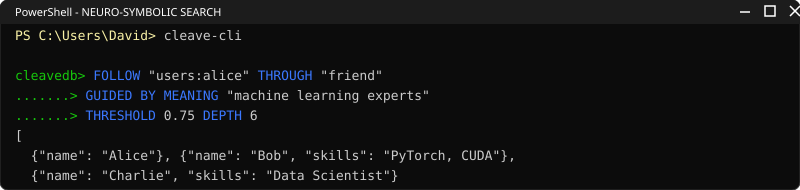
