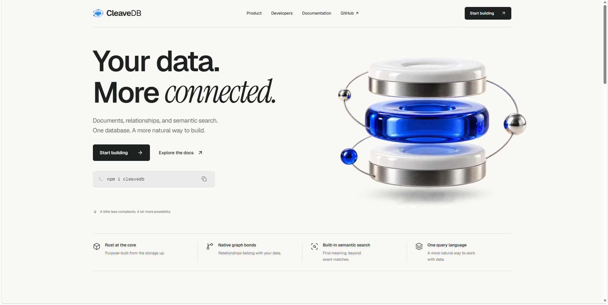

<div align="center">
  
  <br/><br/>
  <p><strong>A database for documents, connected data, and semantic search.</strong></p>


  [](https://www.python.org/downloads/?Python)
  [](https://doc.rust-lang.org/edition-guide/rust-2021/index.html)
  [](https://github.com/Tribrix23/CleaveDB/blob/main/LICENSE)
  [](https://www.npmjs.com/package/cleavedb)
</div>

<br/>

## Overview

**CleaveDB** combines document storage, relational queries, graph traversal, and semantic search in a single database. Store JSON documents in buckets, connect them through native relationships called **bonds**, and query both their contents and their connections with **CleaveQL**, an English-like query language.

Built on a custom **Rust storage engine**, CleaveDB brings these capabilities together so you can work with structured data, explore relationships, and find relevant information by meaning within the same system.

- **Flexible document storage:** Organize JSON documents in buckets and query their fields.
- **Connected data:** Create native graph bonds and follow relationships across documents and buckets.
- **Search by meaning:** Use Transformer embeddings to discover relevant documents beyond exact keyword matches.
- **Unified querying:** Read, write, filter, sort, aggregate, and traverse data with CleaveQL.

Visit the [CleaveDB website](https://cleavedb.devctr.com/) for documentation and getting started.

[](https://cleavedb.devctr.com/)

## 💾 Installation

### Option A: Download Pre-Compiled Binary (Recommended)
You do **not** need to install Python, Rust, or C++ build tools. We provide a single, self-contained executable that has the hardware-accelerated C++ AVX-512 extensions and Rust engine fully baked in.

1. Go to the [Releases](https://github.com/Tribrix23/CleaveDB/releases) page.
2. Download `CleaveShell.exe` (or the equivalent for your OS).
3. Double-click the executable to start the database server and interactive shell.

> [!NOTE]
> **Windows SmartScreen Notice**
> Because CleaveDB is an independent, open-source project, the Windows installer does not use an expensive corporate EV certificate. When downloading or running the `.exe`, Windows or Edge might flag it as "unrecognized".
> To bypass this, click **Keep -> Keep anyway** in Edge, and **More info -> Run anyway** on the blue Windows screen.

*(You can now execute all CleaveQL queries directly in your terminal, or connect via the NPM Client!)*

---

### Option B: Compile from Source (Advanced / Contributors)
If you want to modify the source code, you can compile the engine from scratch.

**Prerequisites:**
- **Python 3.10+**
- **Rust Toolchain** (Install via `rustup` from [rustup.rs](https://rustup.rs/))
- **C++ Build Tools** (For compiling the AVX-512 SIMD extensions)
- *(Optional)* **Go** (For distributed cluster coordinator logic)

**1. Install Python Dependencies**
```bash
pip install -r requirements.txt
```

**2. Run the Master Build Script**
Simply run the orchestrator script, which compiles the C++ SIMD layers, the Go Coordinator, and the Rust storage engine via PyO3/maturin:
```bash
python build.py
```

**3. Start the Server**
Once compiled, start the TCP server:
```bash
python cleavedb_server.py
```
